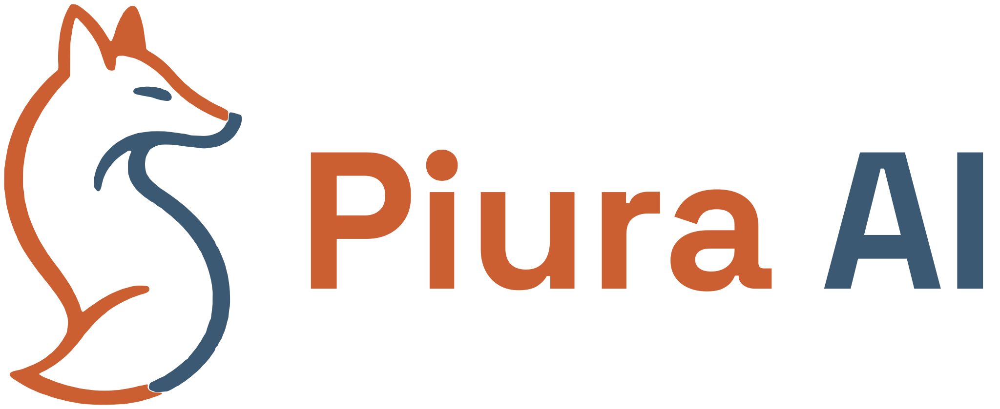

<p align="center">
  
</p>

<p align="center">
  Sitio web de <strong>Piura AI</strong>, la comunidad de inteligencia artificial de Piura, Perú.<br />
  <a href="https://piura-ai.org">piura-ai.org</a> ·
  <a href="https://chat.whatsapp.com/DGupofUTcSI5Ef8CChMfme?mode=gi_t">Únete al grupo de WhatsApp</a>
</p>

---

## Qué es esto

Es la landing de Piura AI: una sola página estática, rápida y pensada para SEO, que presenta a la comunidad, sus principios, los próximos eventos, su trayectoria, los miembros fundadores y los aliados.

Está hecha con [Astro](https://astro.build) y no usa frameworks de UI ni backend. El resultado del build es HTML, CSS e imágenes optimizadas, así que se puede publicar en cualquier hosting estático (Vercel, Netlify, Cloudflare Pages, GitHub Pages, etc.).

## Requisitos

- Node.js 22.12 o superior
- npm

## Primeros pasos

```bash
git clone https://github.com/Piura-AI/piura-ai-landing.git
cd piura-ai-landing
npm install
npm run dev
```

El sitio queda disponible en `http://localhost:4321`.

## Comandos

| Comando           | Qué hace                                                        |
| ----------------- | --------------------------------------------------------------- |
| `npm run dev`     | Servidor de desarrollo con recarga en vivo                      |
| `npm run build`   | Genera el sitio estático en `dist/`                             |
| `npm run preview` | Sirve `dist/` localmente para revisar el build                  |
| `npm run check`   | Revisa tipos y errores de Astro (debe quedar en 0 errores)      |
| `npm run brand`   | Regenera logos, favicons y la imagen para redes (Open Graph)    |
| `npm run deploy`  | Compila y publica en Cloudflare Workers                         |

## Cómo editar el contenido

Casi todo el texto del sitio vive en un solo archivo: **`src/data/site.ts`**. Ahí están:

- Título, descripción y enlaces generales (WhatsApp, correo, redes sociales).
- Cifras de la comunidad.
- Principios del manifiesto.
- Próximos eventos y sus enlaces de registro.
- Hitos de la trayectoria.
- Miembros fundadores.
- Aliados.

No hace falta tocar los componentes para actualizar el contenido.

### Agregar un miembro

1. Guarda su foto en `src/assets/team/nombre-apellido.jpg` (cuadrada, de unos 400×400 px, centrada en el rostro).
2. Impórtala al inicio de `src/data/site.ts`.
3. Agrega una entrada en `founders` con nombre, rol, bio corta y enlace a LinkedIn. El orden de la lista es el orden en pantalla.

### Agregar un evento

Añade un objeto en `events` con la etiqueta (por ejemplo, "Con GDG Piura"), el título, la descripción y el enlace de registro.

### Redes sociales

En `site.socials`, reemplaza `href: null` por la URL. Las redes sin enlace no se muestran.

## Estilo de los textos

- Español con capitalización normal: mayúscula al inicio de cada oración, título, botón y elemento del menú.
- Sin emojis. Para íconos se usa [Lucide](https://lucide.dev).
- Comillas tipográficas (“ ”) y nombres propios respetados: Piura AI, IA, GDG Piura, INNOSPACE.

## Estructura del proyecto

```
├── brand/source/          Fuentes de la marca (zorro vectorizado, logo original, tipografía)
├── brand/social/          Avatar y logos para GitHub y redes sociales
├── public/                Archivos servidos tal cual: favicons, logos, imagen Open Graph
├── scripts/
│   └── build-brand.mjs    Genera todos los assets de marca
├── src/
│   ├── assets/            Fotos del evento y de los miembros (Astro las optimiza a WebP)
│   ├── components/        Una sección de la página por componente
│   ├── data/site.ts       Contenido editable del sitio
│   ├── layouts/           Plantilla base con metadatos SEO
│   ├── pages/             index.astro y robots.txt
│   └── styles/global.css  Colores, tipografías y estilos compartidos
├── AGENTS.md              Guía para agentes de IA que trabajen en el repo
└── DESIGN.md              Sistema de diseño: paleta, tipografía, componentes y layout
```

## Diseño y marca

- **Colores:** crema arena `#F6F3EC` de fondo, azul marino `#22384A` para titulares y terracota `#A8502A` como único color de acción. El detalle está en [DESIGN.md](DESIGN.md).
- **Tipografías:** Space Grotesk para titulares e IBM Plex Sans para el cuerpo, servidas desde el propio sitio.
- **Logo:** el zorro andino se vectorizó a partir del logo original. `npm run brand` genera el logo horizontal, la versión para fondo oscuro, el isotipo, los favicons, `og-image.png` (1200×630) y, en `brand/social/`, el avatar cuadrado para la organización de GitHub y redes sociales.

## SEO

El sitio incluye título y descripción, URL canónica, etiquetas Open Graph y Twitter Card, datos estructurados (`Organization`), `sitemap-index.xml` y `robots.txt`. Todas las URLs absolutas salen del dominio configurado en `astro.config.mjs` (`https://piura-ai.org`). Si alguna vez hace falta otro dominio, por ejemplo para una preview, se puede definir la variable de entorno `SITE_URL`.

## Despliegue

El sitio se publica en **Cloudflare Workers** como archivos estáticos (plan gratuito), con la configuración en `wrangler.jsonc`:

- **Comando de build:** `npm run build`
- **Carpeta de salida:** `dist` (Cloudflare la sirve tal cual, sin código de servidor)
- **Variables de entorno:** ninguna obligatoria
- **Dominio:** `piura-ai.org`. `www.piura-ai.org` redirige al dominio principal.

Para desplegar a mano (requiere `npx wrangler login` con acceso a la cuenta):

```bash
npm run deploy
```

El dominio está registrado en GoDaddy y su DNS está delegado a Cloudflare. El correo del dominio se maneja con Zoho Mail; sus registros MX, SPF y DKIM viven en el DNS de Cloudflare.

## Contribuir

1. Crea una rama desde `main`.
2. Haz tus cambios y verifica que `npm run check` y `npm run build` pasen.
3. Revisa el sitio con `npm run preview` en escritorio y en móvil.
4. Abre un pull request describiendo el cambio.

## Créditos

- Boceto y estructura del sitio: Juan Alberto Quintana.
- Fotos de los miembros tomadas de sus perfiles públicos de LinkedIn.
- Hecho por la comunidad Piura AI.
